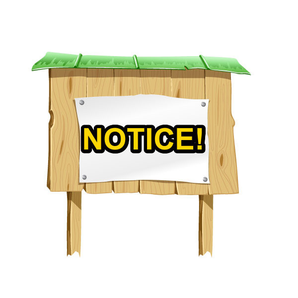
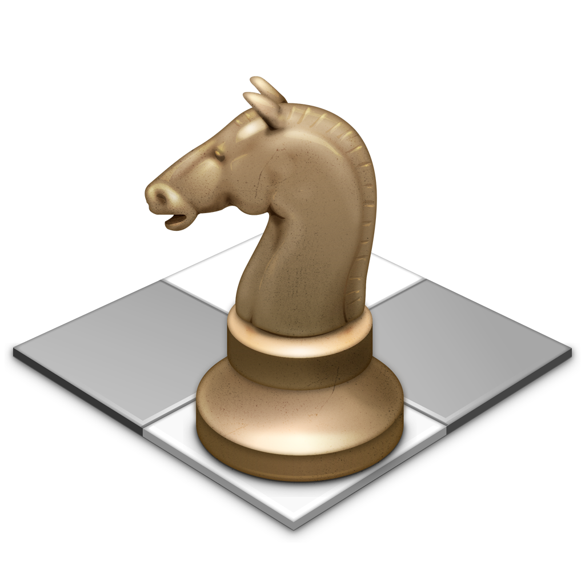
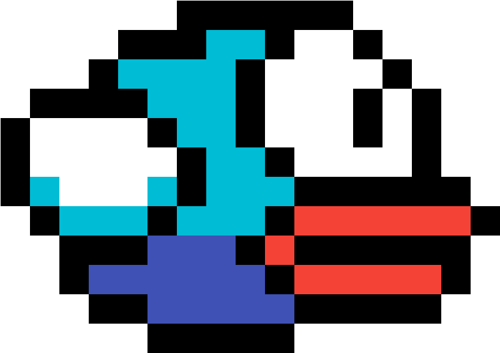

# Added Features

This addition to the Covey.Town Codebase allows users to interact with a two new features "Placeables" and "player Permissions"

## Placeables

Placeables allow players to interact with the world and players around them beyond the already implemented movement and video chat functionality of Covey.town. Allowing users to now place objects onto that map that can either be interactable or non-interactable. Interactable placeables provide users with some additional function such as allowing them to play tic-tac-toe or watch a video.

### Adding placeables

To add placeables to your town:

1. Make sure that you have permission to perform this actions (if you do not see [giving a removing player permissions](#giving-and-removing-player-positions))
2. Click on your user in the town
3. Select which of the placeables you would like to add
4. The placeable will automatically get added next to you

### Deleting placeables

To Delete a placeable from your town

1. Make sure the placeable you want to delete is in view on your screen
2. Make sure that you have permission to perform this actions (if you do not see [giving a removing player permissions](#giving-and-removing-player-positions))
3. Right click on the placeable you would like to delete
4. Then hit Delete. 
   If you would like to cancel the request, hit Cancel

### Current placeables

|  Placeable  |                                       Icon                                       | number of players | Blocks path | Placeable ID |
| :---------: | :------------------------------------------------------------------------------: | :---------------: | :---------: | :----------: |
|    Tree     |     | non interactable  |    true     |     tree     |
|   Flowers   |  | non interactable  |    false    |    flower    |
|   banner    |                |     infinite      |    true     |    banner    |
| Chess board |                 |         1         |    true     |    chess     |
| tic-tac-toe |             |         1         |    true     |  tictactoe   |
| Flappy Bird |            |         1         |    true     |    flappy    |
|   youtube   |               |     infinite      |    true     |   youtube    |

### How to interact with placables

To interact with a placeable:

1. Make sure that you can see the placeable on screen and that it is interactable (see Current placeable number of player column to determine if a placeable is interactable)
2. Click on the placeable you would like to interact
3. A pop up should appear on your screen and you are now ready to go
4. When you want to stop interacting for any reason you can hit the X in the top right corner to return back to the map

## Players Permissions

In order to prevent other user from running amok in your town and planting forests everywhere, users who know the town update password can pick and choose who are able to add placeables through the player permissions functionality. By default all players including the creater of the town do not have permission to create things and so will be unable to add placeables unless they know the password. If you would like to make it so someone in the room can modify placeables but don't want to give them the password to the town, then you can provide permission to them.

### Giving and removing player permissions

To give or remove player permissions.

1. Click on the permissions button that is part of the bar in the top right
2. Type in the town update password in the provided space
3. Find the player(s) you want to change the permission of in the list of players
4. Modify the check box next to their name and id (checked means they have permission, unchecked means they do not have permission)
5. Hit submit. 
   if at any point you do not want to modify anyone's permission, you can hit the cancel button to close the popup.
